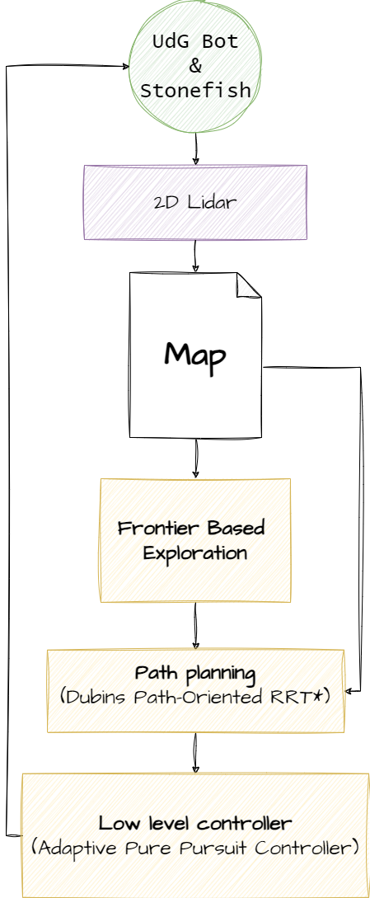
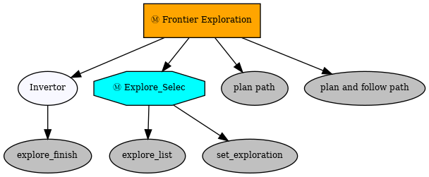

` `

# 📋 HANDS- ON PLANNING

# 📋 Autonomous Exploration of Unknown Environments Using Dubins Path-Oriented RRT*

### 👥 Group Members

   1. 👤 Goitom Abrha Leaku -u1985499
   2. 👤 Eliyas Kidanemariam Abraha -u1992469
   3. 👤 Khaled mohamed Othman -u1992341
   
## 📚 Table of Contents

1. [📖 Introduction](#-introduction)
2. [🔧 Installation](#-installation)
3. [🚀 Usage](#usage)
4. [🛠️ Implementation](#features)
5. [📺 Video Link](#youtube-video-link)

## Introduction

This project focused on exploration and path planning techniques for differential drive robots in unknown environments. By leveraging frontier-based exploration, RRT* with Dubins state space, and high-resolution 2D Lidar, the robot can efficiently and safely navigate. The use of pure pursuit and adaptive pure pursuit controllers ensures the robot can follow the optimal paths generated, adapting to dynamic conditions for robust autonomous navigation.
As shown below the main components.

## <a id="figure1"></a>Flow chart


As shown in [Figure 1](#figure1) for the main flowchart of the project, the key components are as follows:

- **Frontier-Based Exploration** as the main exploration method.
- **2D LIDAR** for accurate obstacle detection and mapping.
- **RRT STAR with Dubins Path** as the planner.
- **Pure Pursuit** and **Adaptive Pure Pursuit** as low-level controllers.

These components were tested in both the Stonefish simulator and on a real robot.

<!-- <div style="background-color: #f0f0f0; padding: 10px;">



<center>Figure 1: Main Flow-chart for the Project</center>

</div> -->

<div style="background-color: #f0f0f0; padding: 10px;">


<center>Figure 1: Main Flow-chart for the Project</center>

</div>

## Installation

In order to use and run this package some prequests are neede to install.

To install Ros1 noetic, follow this [Installation](https://wiki.ros.org/noetic/Installation).

To install Stonefish, follow the instructions provided in this [installation guide](https://github.com/patrykcieslak/stonefish/blob/master/docs/install.rst).


```sh
# Octomap Server
sudo apt install ros-noetic-octomap*
# Py_tree
pip install py_trees
```
## Usage

 To use and run the `frontier_exploration` package run the following commands

  ```sh
  # Go to your catkin workspace src directory assuming it's already created.
  cd ~/catkin_ws/src
  # Download the package to your source directory
  #Build workspace and source it
  Catkin build or Catkin_make   
  source ~/catkin_ws/devel/setup.bash    
  ```

  ```
  # Launch 
  roslaunch frontier_exploration stonefish.launch
  ```


## Implementation

We have a robot with the follwong nodes as the main nodes, with many functions inside the nodes.

`frontier_exploration_node` this node is used to detect frontiers using convolution(which separate known and unknown areas on the map), cluster frontiers and Select frontiers.  

`turtlebot_online_path_planning_node` path planning node using Rapidly-exploring Random Tree Star (RRT*) algorithm integrated with the Dubins Curve algorithm, and with persuit low level controller to fellow the path generated by global planner.


The `behaviour_tree` used is shown in the following figure, with the behaviour ends when the explore_finish is true. The frontier gives the frontier list, and if there is exploration list then the plannar gives path to the frontier list, then follows the path.


<center>Figure 1: Main behaviour tree</center>


<!-- ## Conclusion -->


## Video Link

The video is also available online on [link](https://drive.google.com/file/d/1u8bFsBzKBwW5UvCEE4pjqxqb-E_p4iff/view).
